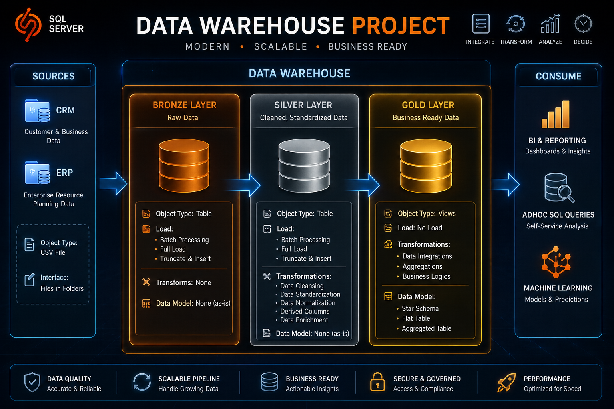

# 🏛️ SQL Data Warehouse Project

<div align="center">
  
  
  -blue?style=for-the-badge&logo=databricks&logoColor=white)
  
  

  <p align="center">
    <strong>A professional-grade, medallion-architecture Data Warehouse implementation using Microsoft SQL Server.</strong>
  </p>
</div>

---

## 🏗️ Data Architecture & Flow

This repository houses a comprehensive end-to-end data warehousing solution designed around the **Medallion Architecture**. Raw data is ingested, cleansed, and modeled into optimized analytics-ready structures.



### 📈 The Medallion Paradigm
*   🟫 **Bronze Layer (Raw Staging):** Houses raw data ingested directly from source CRM & ERP systems. The schema mimics the source files as-is to preserve full history.
*   🥈 **Silver Layer (Cleaned & Standardized):** *Under development.* Cleanses, standardizes data types, deduplicates, and normalizes tables to build a single source of truth.
*   🥇 **Gold Layer (Analytical Modeling):** *Under development.* Houses business-ready datasets modeled into high-performance Star Schemas (Facts & Dimensions) optimized for BI tools (see the [Sales Data Mart Star Schema Diagram](docs/data_model.png)).

---

## 📂 Repository Structure

```directory
data-warehouse-project/
├── datasets/             # Source data files (ERP & CRM raw exports)
├── docs/                 # Architecture design, schemas & documentation
│   ├── data_architecture.png
│   ├── data_flow.png
│   ├── data_integration.png
│   ├── data_model.png    # Sales Data Mart Star Schema design
│   ├── etl_methods.jpg
│   └── gold_layer_data_catalog.jpg
├── scripts/              # SQL pipelines and database initialization
│   ├── init_database.sql # Database & Schema initialization script
│   └── bronze/           # Bronze layer DDL and ingestion procedures
└── tests/                # Data validation and testing scripts
```

---

## 🚀 Quick Start Guide

### Prerequisites
*   **Database Engine:** SQL Server Express or Developer Edition.
*   **Client tool:** SQL Server Management Studio (SSMS) or Azure Data Studio.

### Step 1: Initialize Database & Schemas
Connect to your SQL Server instance and execute the database setup script [init_database.sql](file:///c:/Data-Engineering/github_repos/sql-data-warehouse-project/scripts/init_database.sql). This will drop any existing `DataWarehouse` database and create the database along with `bronze`, `silver`, and `gold` schemas.

### Step 2: Create Bronze Schema DDL
Execute the Bronze DDL script [ddl_bronze.sql](file:///c:/Data-Engineering/github_repos/sql-data-warehouse-project/scripts/bronze/ddl_bronze.sql) to create the staging tables.

### Step 3: Load Raw Data via ETL Stored Procedure
Run the bulk-loading stored procedure [proc_load_bronze.sql](file:///c:/Data-Engineering/github_repos/sql-data-warehouse-project/scripts/bronze/proc_load_bronze.sql) to ingest CSV data into the bronze staging layer.
> [!IMPORTANT]
> Ensure the CSV files are placed in the path matching the `BULK INSERT` paths in the procedure (default path: `C:\sql\dwh_project\datasets\`).
```sql
EXEC bronze.load_bronze;
```

---

## 📋 Data Sources & Catalog

The warehouse integrates two distinct source systems to establish a unified view of customers, products, and sales:

### 1. CRM (Customer Relationship Management)
| Table | Description | Ingestion DDL |
| :--- | :--- | :--- |
| `crm_cust_info` | Customer profile details (names, gender, create date) | [ddl_bronze.sql (L16-L24)](file:///c:/Data-Engineering/github_repos/sql-data-warehouse-project/scripts/bronze/ddl_bronze.sql#L16-L24) |
| `crm_prd_info` | Product master information (costs, lines, dates) | [ddl_bronze.sql (L31-L39)](file:///c:/Data-Engineering/github_repos/sql-data-warehouse-project/scripts/bronze/ddl_bronze.sql#L31-L39) |
| `crm_sales_details` | Transactional sales details (quantity, price, orders) | [ddl_bronze.sql (L46-L56)](file:///c:/Data-Engineering/github_repos/sql-data-warehouse-project/scripts/bronze/ddl_bronze.sql#L46-L56) |

### 2. ERP (Enterprise Resource Planning)
| Table | Description | Ingestion DDL |
| :--- | :--- | :--- |
| `erp_loc_a101` | Customer location mapping (country codes) | [ddl_bronze.sql (L63-L66)](file:///c:/Data-Engineering/github_repos/sql-data-warehouse-project/scripts/bronze/ddl_bronze.sql#L63-L66) |
| `erp_cust_az12` | Supplementary customer details (birth dates, gender) | [ddl_bronze.sql (L73-L77)](file:///c:/Data-Engineering/github_repos/sql-data-warehouse-project/scripts/bronze/ddl_bronze.sql#L73-L77) |
| `erp_px_cat_g1v2` | Product category and maintenance hierarchy | [ddl_bronze.sql (L84-L89)](file:///c:/Data-Engineering/github_repos/sql-data-warehouse-project/scripts/bronze/ddl_bronze.sql#L84-L89) |

---

## 🛠️ Key Tools & Resources

*   **[SQL Server Express](https://www.microsoft.com/en-us/sql-server/sql-server-downloads)** - High-performance database engine.
*   **[SSMS](https://learn.microsoft.com/en-us/sql/ssms/download-sql-server-management-studio-ssms)** - Graphical user interface for database management.
*   **[Notion Project Board](https://thankful-pangolin-2ca.notion.site/SQL-Data-Warehouse-Project-16ed041640ef80489667cfe2f380b269)** - Detailed project phases and interactive checklists.
*   **[Notion Template](https://www.notion.com/templates/sql-data-warehouse-project)** - Ready-to-use project tracker.
*   **[Draw.io](https://www.draw.io/)** - Design interface for data models and diagrams.

---

## 🌟 About Me

**Nisha Sorallikar**  
*Aspiring Data Engineer*  
Passionate about SQL, Python, Data Warehousing, ETL Pipelines, and Data Analytics.

---

## 🛡️ License

This project is licensed under the [MIT License](LICENSE). You are free to use, modify, and share this project with proper attribution.
