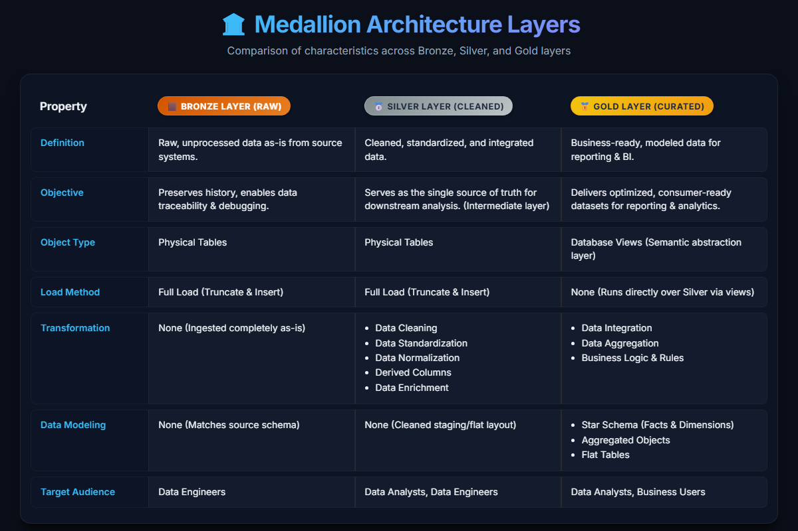
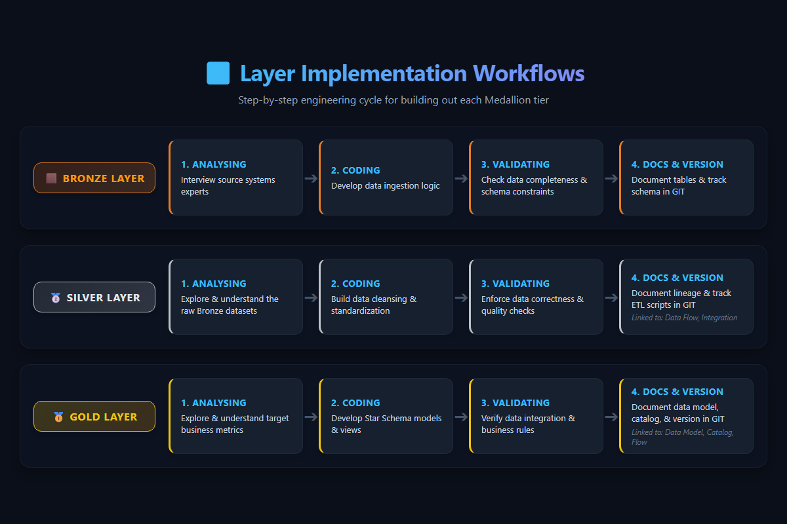
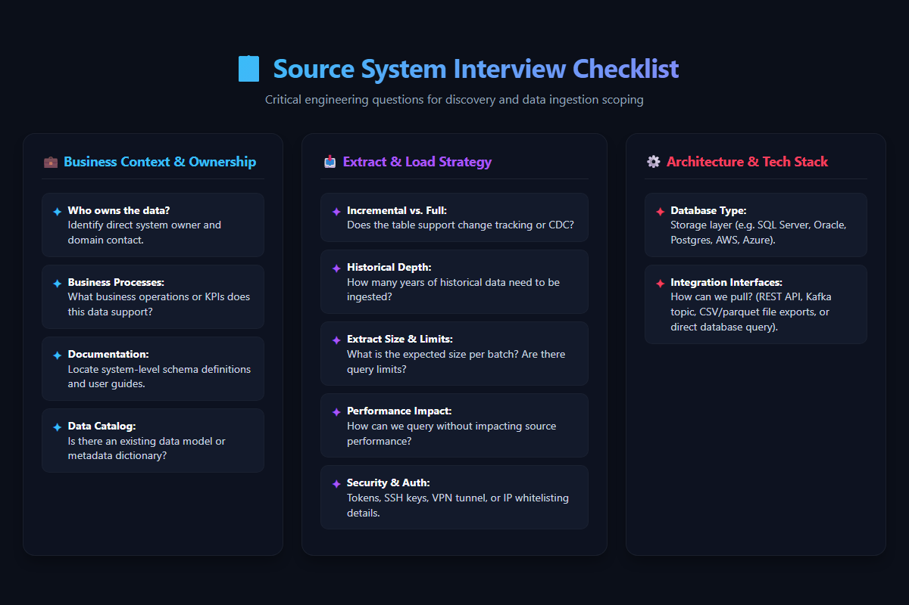

# 🗂️ Data Warehouse Layers & Lifecycle

An overview of the Medallion Architecture data layers, their individual lifecycles, and guidelines for source system ingestion.

---

## 📊 Medallion Layers Comparison

Below is the comparison of characteristics across Bronze, Silver, and Gold layers:

---

## 🔄 Layer Implementation Workflows

The step-by-step engineering cycle for building out each Medallion tier:

---

## 📋 Source System Interview Checklist

Critical engineering questions for discovery and data ingestion scoping:

