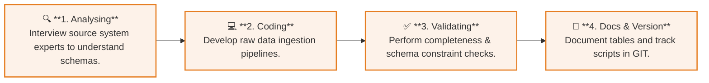
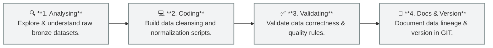
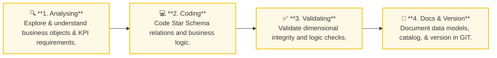
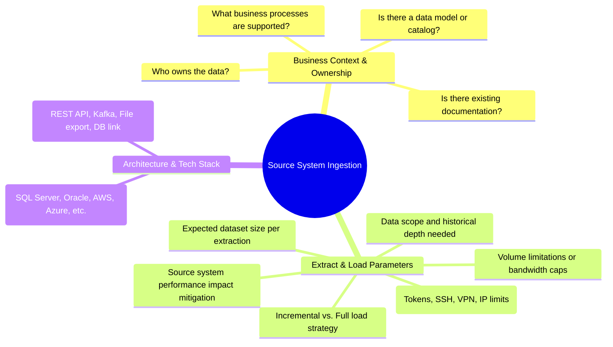

# 🗂️ Data Warehouse Layers & Lifecycle

An overview of the Medallion Architecture data layers, their individual lifecycles, and guidelines for source system ingestion.

---

## 📊 Medallion Layers Comparison

| Property | 🟫 Bronze Layer (Raw) | 🥈 Silver Layer (Cleaned) | 🥇 Gold Layer (Curated) |
| :--- | :--- | :--- | :--- |
| **Definition** | Raw, unprocessed data as-is from source systems. | Cleaned, standardized, and integrated data. | Business-ready, modeled data for reporting & BI. |
| **Objective** | Preserves history, enables data traceability & debugging. | Serves as the single source of truth for downstream analysis. | Delivers optimized, consumer-ready datasets. |
| **Object Type** | Physical Tables | Physical Tables | Database Views (or virtualized layer) |
| **Load Method** | Full Load (Truncate & Insert) | Full Load (Truncate & Insert) | None (Semantic abstraction over Silver) |
| **Data Transformation** | None (Ingested completely as-is) | • Data Cleaning • Standardization • Normalization • Derived Columns • Data Enrichment | • Data Integration • Data Aggregation • Business Logic & Rules |
| **Data Modeling** | None (Matches source schema) | None (Cleaned staging/flat layout) | • Star Schema (Facts/Dimensions) • Aggregated Objects • Flat Tables |
| **Target Audience** | Data Engineers | Data Analysts, Data Engineers | Data Analysts, Business Users |

---

## 🔄 Layer Implementation Workflow

Each layer follows a structured lifecycle to ensure quality, maintainability, and traceability.

### 1. 🟫 Bronze Layer Workflow

### 2. 🥈 Silver Layer Workflow

### 3. 🥇 Gold Layer Workflow

---

## 📋 Source System Interview Checklist

Before ingesting any new source system, data engineers must conduct a discovery interview covering these three critical areas:

### 🔑 Key Inquiries & Details

> [!IMPORTANT]
> **Business Context & Ownership**
> - **Data Ownership:** Identify the system owner and key point-of-contact for schema changes or data quality issues.
> - **Business Processes:** Document which applications or dashboards rely on this dataset to assess criticality.

> [!TIP]
> **Extract & Load Strategy**
> - **Performance Impact:** Schedule high-volume extractions during off-peak hours.
> - **Load Strategy:** Prefer incremental extraction using Change Data Capture (CDC) or timestamp filters over daily full loads for large datasets.

> [!WARNING]
> **Security & Compliance**
> - Ensure all connection strings, API keys, and credentials are stored securely and never hardcoded in ingestion scripts.
